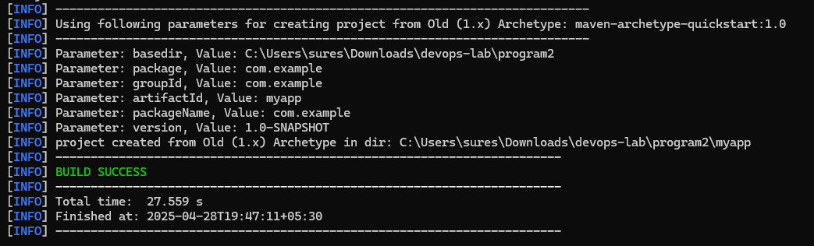
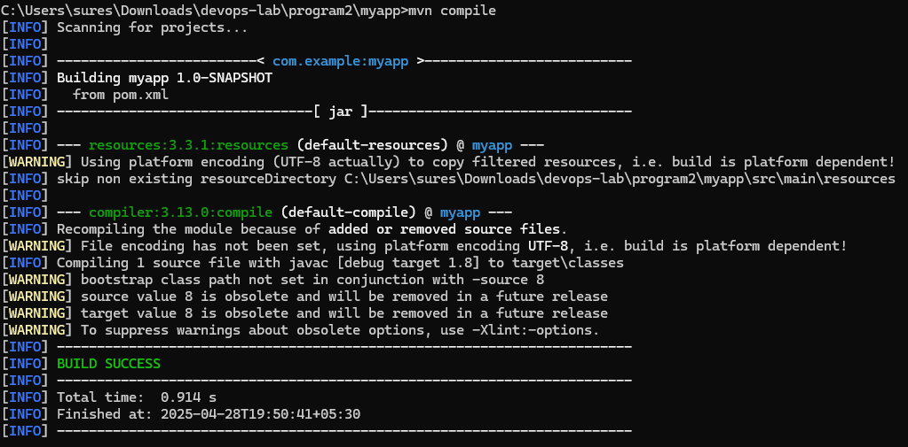
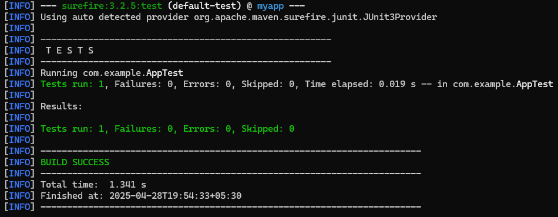
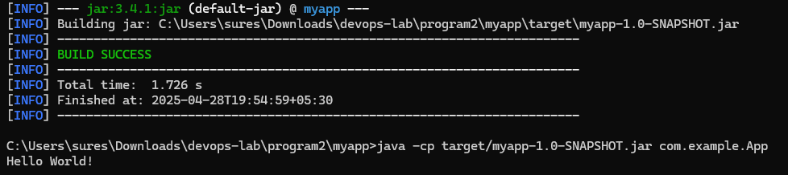

# Example Output

```
cd myapp

// Compile the source code
mvn compile

// Execute unit tests
mvn test

// Build the JAR package
mvn package

// Launch the application from the JAR
java -cp target/myapp-1.0-SNAPSHOT.jar com.example.App
```





