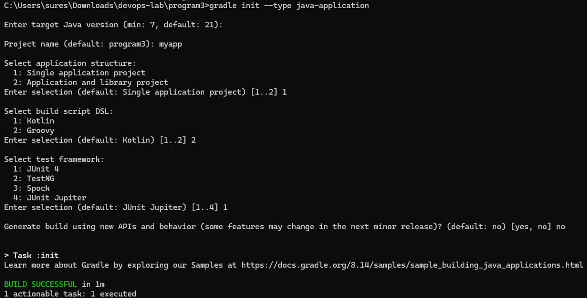
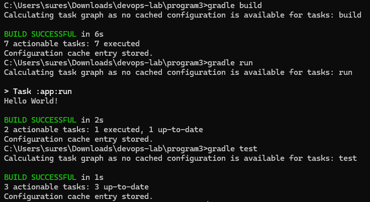

# Example Output

```
// Initialize a Java application project with Gradle
gradle init --type java-application

// Compile the project using Gradle
gradle build

// Execute the application
gradle run

// Run the test suite
gradle test
```



