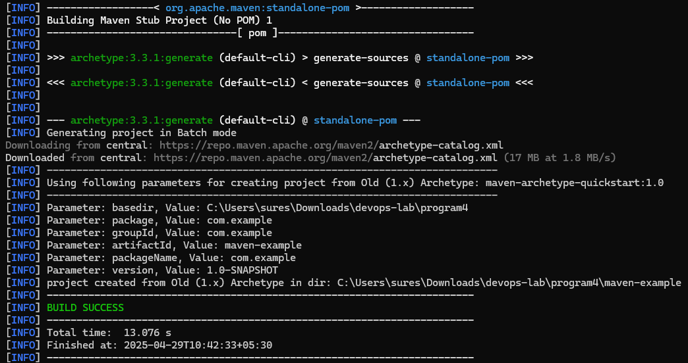
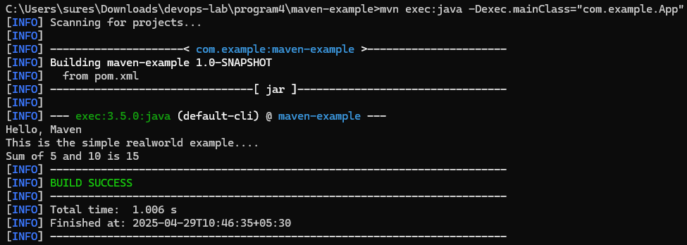
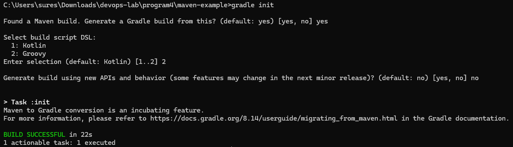
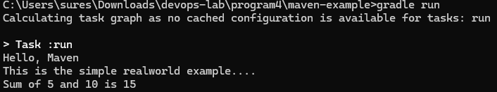

# Example Output

```
// Step 1: Set up a Maven project
mvn archetype:generate -DgroupId=com.example -DartifactId=maven-example -DarchetypeArtifactId=maven-archetype-quickstart -DinteractiveMode=false
cd maven-example

// Step 2: Build and execute using Maven
mvn clean install
mvn exec:java "-Dexec.mainClass=com.example.App"

// Step 3: Convert Maven project to Gradle
gradle init

// Step 4: Build and run with Gradle
gradle build
gradle run
```

```
// Insert this task into your build.gradle file

task run(type: JavaExec) {
    main = 'com.example.App'
    classpath = sourceSets.main.runtimeClasspath
}
```





